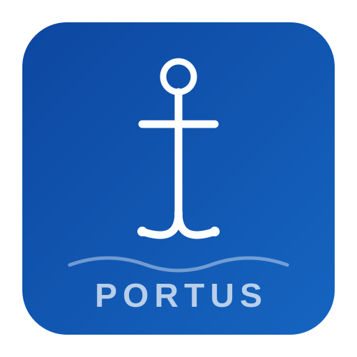

<p align="center">
  
</p>

<h1 align="center">Portus</h1>
<p align="center"><em>Interoperable control and notarization for electronic Bills of Lading on IOTA.</em></p>

<p align="center">
  Portus is an IOTA Move prototype for the eBL lifecycle, title transfer, anti-fraud verification and cross-platform control handover.<br/>
  The core idea is not to build another closed eBL silo, but to show how IOTA can act as a neutral control and settlement layer for trade documents.
</p>

---

## Live

| | Link |
|---|---|
| **App** | [portus-five.vercel.app](https://portus-five.vercel.app/) |
| **Package (Mainnet)** | [`0xdeadee97...e108`](https://explorer.iota.org/object/0xdeadee97bb146c273e9cc55ec26c1d2936133119acc1b2fc0b542e279007e108?network=mainnet) |
| **Deploy TX** | [`B7EDpYuY...CYeD`](https://explorer.iota.org/txblock/B7EDpYuYjfCuSjiEh3ucefvweACtanw55zhVrKfRCYeD?network=mainnet) |
| **Video Demo** | [YouTube](https://youtu.be/Hw4A1folQYI) |

<p align="center">
  <a href="https://youtu.be/Hw4A1folQYI">
    
  </a>
</p>

---

## Why this project exists

The eBL market is moving, but it is still fragmented. Platforms can digitize the document, yet cross-platform handover, auditability and neutral proof of control remain hard. Portus addresses that gap by combining an on-chain eBL workflow with an interoperability layer that stores document envelope hashes, controller metadata and transfer state in a shared IOTA object model.

The project is intentionally positioned around **control**, not abstract ownership claims. For interoperable trade documents, what matters is who currently controls the record, who is allowed to receive it next, what proof bundle was expected, and whether the handover was completed or rejected. That is the problem Portus models on-chain.

## Why IOTA adds value

IOTA is a strong fit here because the trade-document flow is stateful, high-volume and audit-heavy. Portus uses Move objects to represent the eBL, endorsement chain and interop control token as explicit state machines. This makes the workflow easier to reason about than a loose collection of hashes, and it keeps the control trail visible from issuance to surrender.

IOTA also gives the project a pragmatic path toward low-friction settlement infrastructure: notarized data, shared objects, wallet-based signatures and a clean way to extend the MVP toward sponsored transactions and stronger identity verification later.

## What Portus implements today

Portus currently ships five Move modules and seven frontend pages.

The on-chain layer covers the native eBL lifecycle (`ebl`), endorsement-driven transfer (`endorsement`), document hash anchoring (`notarization`), carrier registration (`carrier_registry`) and an interoperability control registry (`interop_control`).

The web app exposes those flows through `Carrier Desk`, `Transfer Hub`, `Port Release`, `Anti-Fraud`, `Interop Layer`, `History` and the `eBL Viewer`.

## Interop layer: DID/VC + PINT-lite metadata

The interoperability flow is the main differentiator of the project.

When a document is registered in `interop_control`, Portus stores the envelope hash together with the active controller wallet, controller DID, party code and an identity bundle hash derived from the provided credential evidence. When a transfer is initiated, the contract records the pending recipient wallet, recipient DID, recipient party code, recipient platform, transfer proof hash, transfer nonce and expiry timestamp. The recipient can only accept if the wallet, DID, party code and presentation hash match the pending values.

The frontend now supports two identity evidence modes. The strongest path is a signed VC/VP JWT flow backed by **IOTA Identity WASM**, where the sample buttons generate real `did:jwk` credentials and presentations and the app verifies their signatures before submitting the transaction. The fallback path still accepts structured VC/VP JSON and binds its deterministic SHA-256 hash on-chain, which keeps the MVP usable even without a full external issuer setup.

## Architecture

```text
+-------------------------------------------------------------------+
|                           IOTA Move                               |
+---------------+---------------+---------------+-------------------+
| ebl           | endorsement   | notarization  | carrier_registry  |
+---------------+---------------+---------------+-------------------+
|                    interop_control (PINT-lite)                    |
+-------------------------------------------------------------------+
|                     React + TypeScript + dApp Kit                 |
+-------------------------------------------------------------------+
```

## Smart contracts

| Module             | Purpose                                        | Main functions                                                                 |
| ------------------ | ---------------------------------------------- | ------------------------------------------------------------------------------ |
| `ebl`              | eBL lifecycle and port-release state           | `register_carrier`, `issue_ebl`, `update_status`, `surrender`, `accomplish`    |
| `endorsement`      | Title transfer and endorsement trail           | `create_chain`, `endorse_and_transfer`                                         |
| `notarization`     | Hash anchoring and integrity checks            | `notarize`, `verify`, `batch_notarize`                                         |
| `carrier_registry` | Carrier profile metadata                       | `register`, `increment_bls`                                                    |
| `interop_control`  | Cross-platform control tracking and settlement | `register_document`, `initiate_transfer`, `accept_transfer`, `cancel_transfer` |

### Mainnet deployment

| Object | ID |
|--------|----|
| Package | `0xdeadee97bb146c273e9cc55ec26c1d2936133119acc1b2fc0b542e279007e108` |
| BLRegistry | `0xc737577bc5fa5976140898b2102c3ed11f2c575620dc7f1b1bb7a8284703fd59` |
| GlobalCarrierRegistry | `0x14033eab3a9418fead914f2da81152f41739f4d5f987085374cf795bfcd05415` |
| InteropRegistry | `0xdf01507dc93c5a5f5fc1c912f860239f6bdba78fc68c7a62f87adc40a316a0ee` |

## Local setup

### Prerequisites

- IOTA CLI installed and configured
- Node.js 24+ recommended
- an IOTA-compatible browser wallet
- testnet funds for the wallets used in the demo

### Build and test the contracts

```bash
cd contracts
 iota move build
 iota move test
```

### Deploy to testnet/mainnet

```bash
cd scripts
chmod +x deploy.sh
TARGET_NETWORK=testnet/mainnet bash deploy.sh
```

The script prints the values you need for the frontend configuration:

```env
VITE_NETWORK=testnet/mainnet
VITE_PACKAGE_ID=0x...
VITE_BL_REGISTRY_ID=0x...
VITE_CARRIER_REGISTRY_ID=0x...
VITE_INTEROP_REGISTRY_ID=0x...
VITE_RPC_URL=https://api.testnet.iota.cafe:443 (or empty for mainnet)
```

### Run the frontend

```bash
cd frontend
npm install
npm run dev
```

Open `http://localhost:5173` and connect your wallet.

## Verification status

The current codebase has:

- frontend production build passing with `npm run build`
- Move unit tests passing with `iota move test` (`20/20`)
- an end-to-end script in `scripts/e2e-test.ts` for funded testnet wallets


## Documentation

- See `Tutorial.md` for the step-by-step operator guide.
- See `scripts/deploy.sh` for the deployment flow.

## Project structure

```text
portus/
  contracts/
    sources/
    tests/
  frontend/
    src/
      components/
      config/
      hooks/
      pages/
      utils/
  scripts/
  README.md
  Tutorial.md
```

## Licence

Apache-2.0
